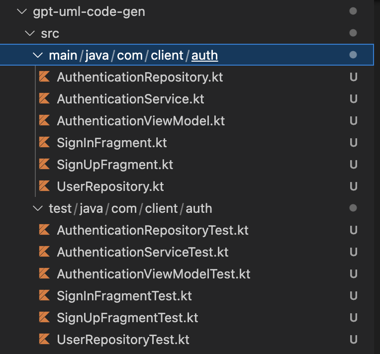

# GPT UML Code Gen

In this proof of concept project we attempt to teach ChatGPT basic UML to generate code, consume the output and create actual files in a project. The idea is for developers to provide a `schema` of sorts and for ChatGPT to generate some boilerplate code to avoid set up time.

The goal is to go from this prompt

```
+ sign in fragment (SIF)
+ sign up fragment (SUF)
+ authentication viewmodel (AVM)
+ authentication repository (AR)
+ user repository (UR)
- navigation manager (NM)
+ authentication service (AS)
SIF --> AVM
SUF --> AVM
AVM --> AR
AVM --> UR
AVM --> NM
AR --> AS
```

to these files



# Setup

Project was tested with [python3](https://www.python.org/downloads/)

```console
pip install openai
pip install openai[datalib]
pip install tiktoken
pip install halo
```

Create/Get your ChatGPT api token [here](https://platform.openai.com/account/api-keys)
and use it here.

```python
openai.api_key = "<API_TOKEN>"
```

Edit your training sample files [here](/samples)

Edit the diagram [here](diagram)

Run any script with python
```console
python chat-gpt-uml-kotlin.py --help

python chat-gpt-uml-kotlin.py --package auth --diagram diagram --samples samples --debug
```
